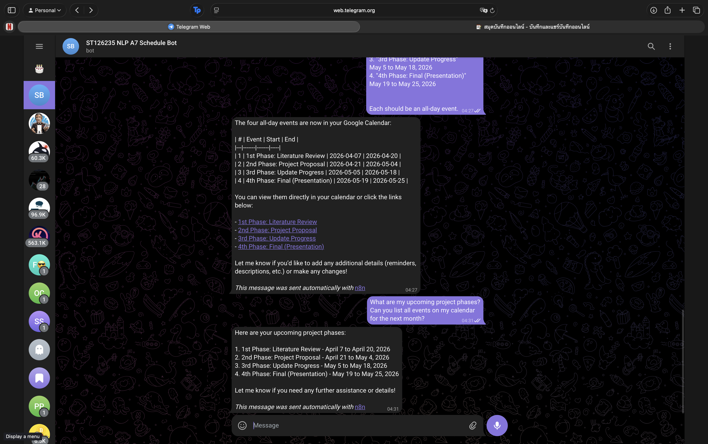
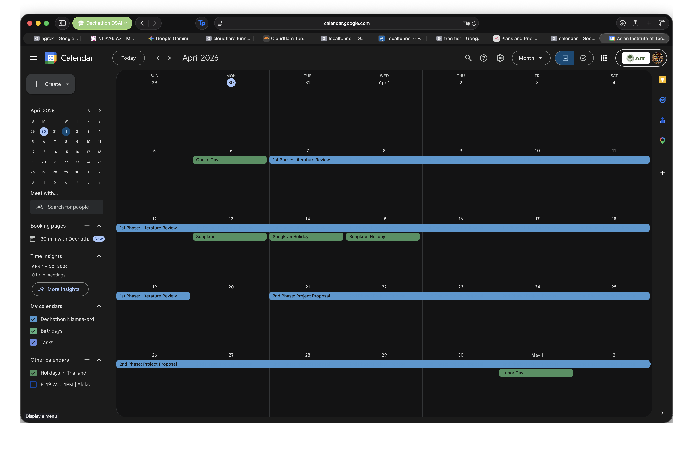
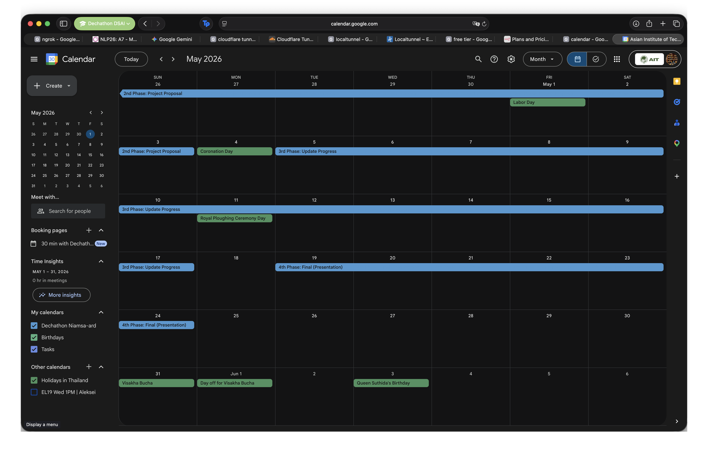
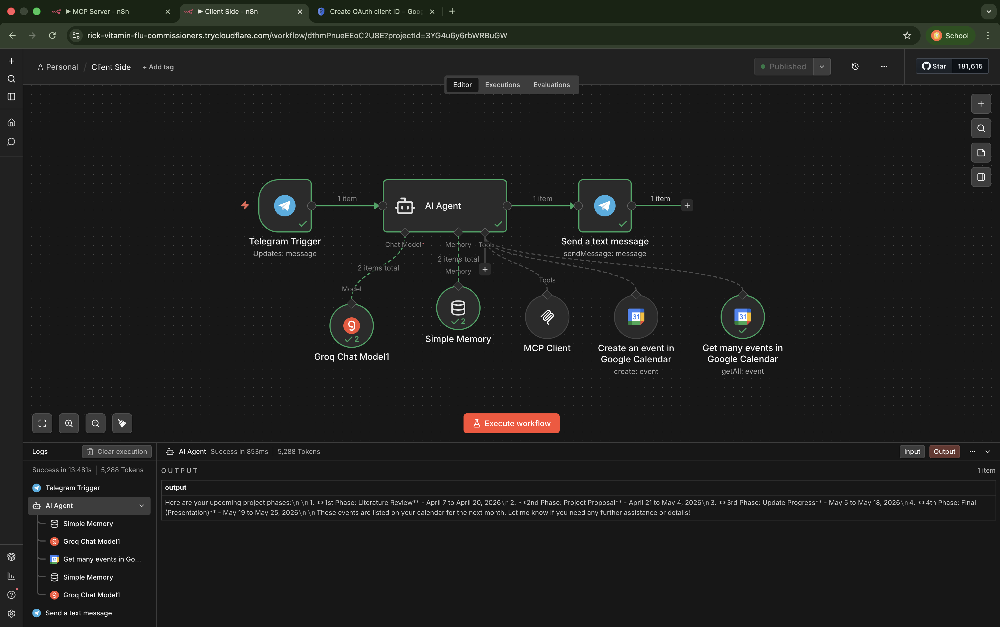

# A7: MCP-Server, AI Agent, and External Tool Integration

**NLU Assignment 7** — MCP-Server, AI Agent, and External Tool Integration
**Student**: Dechathon Niamsa-ard [st126235]

---

## Overview

This project builds an integrated AI Agent ecosystem using the **Model Context Protocol (MCP)** on n8n, deployed locally via **Docker** (with PostgreSQL backend) and exposed to the internet using a **Cloudflare Quick Tunnel** — replacing ngrok as the tunneling solution. The agent is connected to a **Telegram Bot** for real-time messaging and to **Google Calendar** for autonomous event management, demonstrating a practical NLU-powered scheduling assistant capable of understanding natural language commands and taking real-world actions.

> **Infrastructure note:** Instead of ngrok (as described in the guide), this setup uses `cloudflared tunnel --url http://localhost:5678` which generates a temporary public HTTPS URL with no account or token required. The URL is used as the n8n Webhook/Production URL for all MCP and Telegram callbacks.

---

## Task 1: MCP Infrastructure & Server Setup (3 Points)

### 1.1 Server Deployment — Docker + Cloudflare Tunnel (0.5 pts)

n8n is self-hosted via **Docker Compose** backed by a **PostgreSQL 16** database for persistent workflow and credential storage. The local instance is exposed publicly using **Cloudflare Quick Tunnel**:

```bash
cloudflared tunnel --url http://localhost:5678
```

This creates a stable HTTPS endpoint (e.g., `https://rick-vitamin-hu-commissioners.trycloudflare.com`) that n8n uses as its `WEBHOOK_URL`, making all webhooks and MCP SSE endpoints reachable from the internet.


*Cloudflare Quick Tunnel running in the terminal — the generated public HTTPS URL is printed and used as the n8n Webhook URL throughout the entire assignment.*


*n8n dashboard loaded in the browser via the public Cloudflare URL, confirming the tunnel is active and the instance is reachable from the internet. The URL bar shows the trycloudflare.com domain.*

---

### 1.2 MCP Server Workflow — 3 Internal Tools (1 pt)

A dedicated workflow named **"MCP Server"** acts as the tool provider. An **MCP Server Trigger** node is the entry point; three internal tool nodes branch from it:

| Tool | Node Type | Function |
| ---- | --------- | -------- |
| **Calculator** | Built-in Calculator | Evaluates arithmetic expressions |
| **Date & Time** | Code Tool (`Date_and_Time`) | Returns current date/time in Asia/Bangkok (UTC+7) |
| **Get_Latest_News** | HTTP Request Tool | Fetches BBC News RSS via `api.rss2json.com` — no API key needed |

The workflow is toggled **Active** (Published). The resulting **Production URL** (ending in `/sse`) is the SSE endpoint that the AI Agent Client connects to.


*MCP Server workflow: MCP Server Trigger connected to Calculator, Date & Time, and HTTP Request (Get_Latest_News). The workflow is in Active/Published state, exposing all three tools over the SSE endpoint.*

---

### 1.3 AI Agent Client (1.5 pts)

A second workflow named **"Client Side"** contains the AI Agent. It is configured as a **Tools Agent** with the following components:

| Component | Configuration |
| --------- | ------------- |
| **Trigger** | When chat message received (Chat Trigger) |
| **AI Agent type** | Tools Agent |
| **Chat Model** | OpenAI Chat Model node → Groq API (`llama-3.3-70b-versatile`), Base URL: `https://api.groq.com/openai/v1` |
| **Memory** | Simple Memory — Window Buffer Memory, context window length: 10 |
| **Tool** | MCP Client — SSE Endpoint set to the MCP Server Production URL |

The agent is verified by chatting directly in n8n. The execution log shows the MCP Client discovering and invoking tools on the MCP Server.


*Client Side workflow executing a news query. The user asks for the latest BBC news; the agent calls the MCP Client → HTTP Request tool and returns structured headlines. The execution log on the right confirms the full tool call chain: AI Agent → Simple Memory → Groq Chat Model → MCP Client → HTTP Request.*

---

## Task 2: Telegram & Google Calendar Integration (3 Points)

### 2.1 Telegram Bot API (0.5 pts)

The Client Side workflow is extended to use **Telegram** as the messaging channel:

- The **When chat message received** trigger is replaced with a **Telegram Trigger** node (listening for `message` updates, credential: Bot Token from BotFather).
- A **Send a text message** node is added after the AI Agent output, routing the agent's reply back to the user's Telegram chat.
- The bot is named **"ST126235 NLP A7 Schedule Bot"**.

Flow: `Telegram Trigger → AI Agent → Send a text message`


*Client Side workflow updated with Telegram Trigger (left) and Send a text message node (right). The execution log shows a successful Telegram send in ~470ms, with the output confirming the `message_id` and chat details.*


*Live Telegram conversation: the bot correctly reports today's date as **March 30, 2026** (Bangkok timezone) using the Date & Time MCP tool, and fetches five BBC News front-page headlines using the Get_Latest_News MCP tool — both tools invoked transparently via the MCP Server.*

---

### 2.2 Google Calendar Tool (0.5 pts)

Two **Google Calendar** nodes are added to the AI Agent's tool set via OAuth 2.0 credentials (Google Cloud Console — Calendar API enabled, redirect URI set to the Cloudflare tunnel URL):

- **Create an event in Google Calendar** — creates new calendar events with title, date range, and all-day flag
- **Get many events in Google Calendar** — retrieves upcoming events for read/verification queries

The agent's system prompt is configured to treat Asia/Bangkok (UTC+7) as the default timezone and always use ISO 8601 date formatting.


*The AI Agent now has five tools: Groq Chat Model, Simple Memory, MCP Client, Create an event in Google Calendar, and Get many events in Google Calendar. The execution log shows the agent successfully listing all four project phase events with Google Calendar direct links.*

---

### 2.3 Automated Project Scheduling (1 pt)

A natural language scheduling command is sent to the bot via Telegram, requesting creation of four all-day project phase events:

> *"Please create 4 Google Calendar events for my project:*
> *1. '1st Phase: Literature Review' April 7 to April 20, 2026*
> *2. '2nd Phase: Project Proposal' April 21 to May 4, 2026*
> *3. '3rd Phase: Update Progress' May 5 to May 18, 2026*
> *4. '4th Phase: Final (Presentation)' May 19 to May 25, 2026*
> *Each should be an all-day event."*

The agent parses the intent, calls **Create an event in Google Calendar** four times, and replies with a confirmation summary table and direct links.

| # | Event | Start | End |
| - | ----- | ----- | --- |
| 1 | 1st Phase: Literature Review | 2026-04-07 | 2026-04-20 |
| 2 | 2nd Phase: Project Proposal | 2026-04-21 | 2026-05-04 |
| 3 | 3rd Phase: Update Progress | 2026-05-05 | 2026-05-18 |
| 4 | 4th Phase: Final (Presentation) | 2026-05-19 | 2026-05-25 |


*Telegram conversation: the user sends the project scheduling command; the bot confirms all four phases have been added to Google Calendar, with a summary table showing event titles, date ranges, and clickable direct links to each Google Calendar event. Then, n8n execution log for the scheduling command. The workflow shows: Telegram Trigger → AI Agent (invoking Create an event ×4) → Send a text message. The agent output in the right panel lists all four phases with ISO-formatted start/end dates and Google Calendar event URLs.*

---

### 2.4 Interaction Verification (1 pt)

A follow-up verification query is sent via Telegram to confirm the events are live on Google Calendar:

> *"What are my upcoming project phases? Can you list all events on my calendar for the next month?"*

The bot calls **Get many events in Google Calendar**, retrieves all four events, and responds with the full schedule.


*Telegram verification conversation: the bot reads back all four project phases with their exact date ranges using the Get many events tool, confirming the events exist on Google Calendar. The user's second message is answered with a correctly formatted upcoming-events summary.*

**Google Calendar — April 2026:**


*April 2026 calendar view showing **"1st Phase: Literature Review"** spanning Apr 7–20 and **"2nd Phase: Project Proposal"** beginning Apr 21, both displayed as all-day events across the correct date range.*

**Google Calendar — May 2026:**


*May 2026 calendar view showing **"2nd Phase: Project Proposal"** (ending May 4), **"3rd Phase: Update Progress"** (May 5–18), and **"4th Phase: Final (Presentation)"** (May 19–25) — all four phases are visually confirmed on the calendar.*

**Final workflow state:**


*Final state of the Client Side workflow: Telegram Trigger → AI Agent (Groq Chat Model, Simple Memory, MCP Client, Create an event, Get many events) → Send a text message. Execution log confirms the agent correctly lists all four upcoming phases in response to the verification query.*

---

## Architecture Summary

```text
                   ┌─────────────────────────────────────────────────┐
                   │              MCP Server Workflow                │
                   │  MCP Server Trigger ──► Calculator              │
                   │                    ──► Date & Time (Code Tool)  │
                   │                    ──► Get_Latest_News (HTTP)   │
                   └───────────────────────┬─────────────────────────┘
                                           │ Production URL (SSE)
                   ┌───────────────────────▼─────────────────────────┐
                   │             Client Side Workflow                │
                   │  Telegram Trigger                               │
                   │       ↓                                         │
                   │  AI Agent  (Groq llama-3.3-70b-versatile)      │
                   │    ├── Simple Memory (Window Buffer, k=10)      │
                   │    ├── MCP Client ──► MCP Server (SSE)         │
                   │    ├── Create an event in Google Calendar       │
                   │    └── Get many events in Google Calendar       │
                   │       ↓                                         │
                   │  Send a text message (Telegram)                 │
                   └─────────────────────────────────────────────────┘
                                           ↑
                   cloudflared tunnel --url http://localhost:5678
                   (Cloudflare Quick Tunnel — public HTTPS, no account needed)
```

| Component | Details |
| --------- | ------- |
| **n8n** | Self-hosted via Docker, PostgreSQL 16 backend, port 5678 |
| **Tunnel** | Cloudflare Quick Tunnel (`cloudflared`) — no account or token required |
| **LLM** | Groq API — `llama-3.3-70b-versatile` (free tier, OpenAI-compatible) |
| **Memory** | Window Buffer Memory — context window 10 turns |
| **MCP Tools** | Calculator, Date & Time (Code), Get_Latest_News (BBC RSS via HTTP) |
| **Messaging** | Telegram Bot API — ST126235 NLP A7 Schedule Bot |
| **Calendar** | Google Calendar API via OAuth 2.0 (Create + Get events) |

---

## Setup

### 1. Configure `local_n8n/.env`

The `.env` file holds database credentials and the public tunnel URL used by n8n as its `WEBHOOK_URL`:

```env
# Database Config
DB_USER=n8n_admin
DB_PASSWORD=your_password
DB_NAME=n8n_db

# Tunnel URL (update this each time cloudflared generates a new URL)
NGROK_URL=https://<your-tunnel>.trycloudflare.com
```

> The variable is named `NGROK_URL` for compatibility with the `docker-compose.yaml` template, but the value is a **Cloudflare Quick Tunnel** URL.

### 2. Start the stack

```bash
cd local_n8n
docker compose up -d
```

### 3. Start the Cloudflare tunnel

```bash
cloudflared tunnel --url http://localhost:5678
# → Copy the generated HTTPS URL into local_n8n/.env as NGROK_URL, then restart:
docker compose restart n8n
```

### 4. Configure n8n workflows

```text
- Create / import the MCP Server workflow, publish it, note the Production URL (ends in /sse)
- Create the Client Side workflow:
    - Configure Groq API credentials (llama-3.3-70b-versatile)
    - Set MCP Client SSE Endpoint to the MCP Server Production URL
    - Configure Telegram Bot credentials (Bot Token from BotFather)
    - Configure Google Calendar OAuth2 credentials
- Activate the Client Side workflow
```

---

## References

- n8n Documentation — [docs.n8n.io](https://docs.n8n.io)
- Cloudflare Quick Tunnels — [developers.cloudflare.com/cloudflare-one/connections/connect-networks/do-more-with-tunnels/trycloudflare](https://developers.cloudflare.com/cloudflare-one/connections/connect-networks/do-more-with-tunnels/trycloudflare/)
- Groq API — [console.groq.com](https://console.groq.com)
- Google Calendar API — [developers.google.com/calendar](https://developers.google.com/calendar)
- Telegram Bot API — [core.telegram.org/bots/api](https://core.telegram.org/bots/api)
- Assignment reference environment — [github.com/chaklam-silpasuwanchai/Python-fo-Natural-Language-Processing/tree/main/Code/11%20-%20Agentic%20AI/local_n8n](https://github.com/chaklam-silpasuwanchai/Python-fo-Natural-Language-Processing/tree/main/Code/11%20-%20Agentic%20AI/local_n8n)

---
